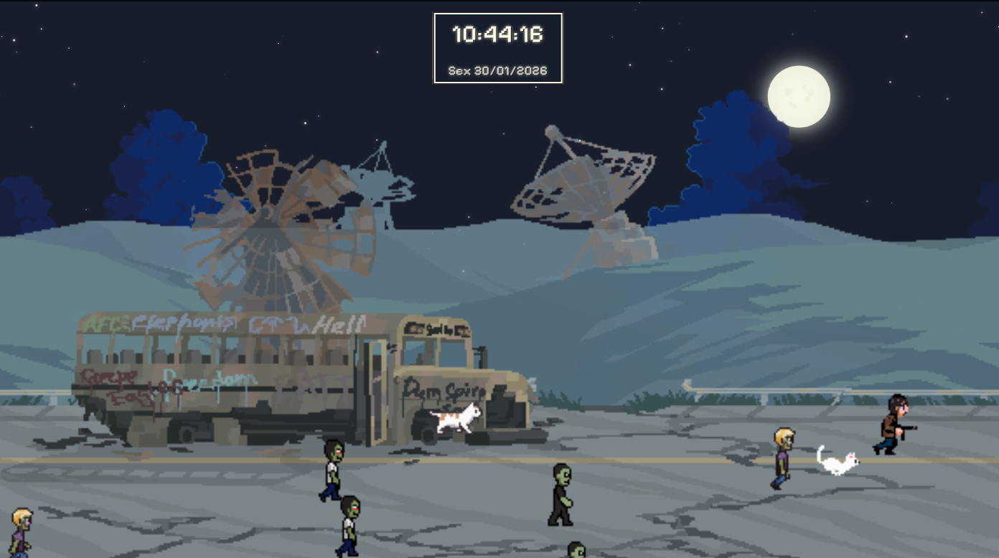

# Wallpaper Wasteland

	

Um wallpaper interativo em HTML, CSS e JavaScript com visual 8bit, apresentando:

- Camadas de céu e casas sobrepostas com paralaxe.
- Céu noturno animado com estrelas piscando e lua animada.
- Personagens animados atravessando o cenário, incluindo múltiplos zumbis e personagens únicos.
- Relógio 8bit centralizado no topo, exibindo hora e dia.
- Estilo visual pixel art em todos os detalhes.

## Como usar

1. Clone ou baixe este repositório.
2. Abra o arquivo `index.html` em seu navegador.
3. Aproveite o wallpaper interativo!

## Estrutura
- `index.html` — Estrutura principal do wallpaper.
- `styles.css` — Estilos, incluindo paralaxe e pixel art.
- `script.js` — Animações, lógica dos personagens e relógio.
- `imgs/` — Imagens de céu e casas.
- `animations/` — Spritesheets e frames dos personagens animados.

## Créditos
- Personagens: [PixelLab](https://www.pixellab.ai)
- sprites e imagens: [Craftpix](https://craftpix.net)
- Fonte 8bit: [Pixelify Sans](https://fonts.google.com/specimen/Pixelify+Sans)

---

Projeto criado para fins de estudo, inspiração e diversão visual.
